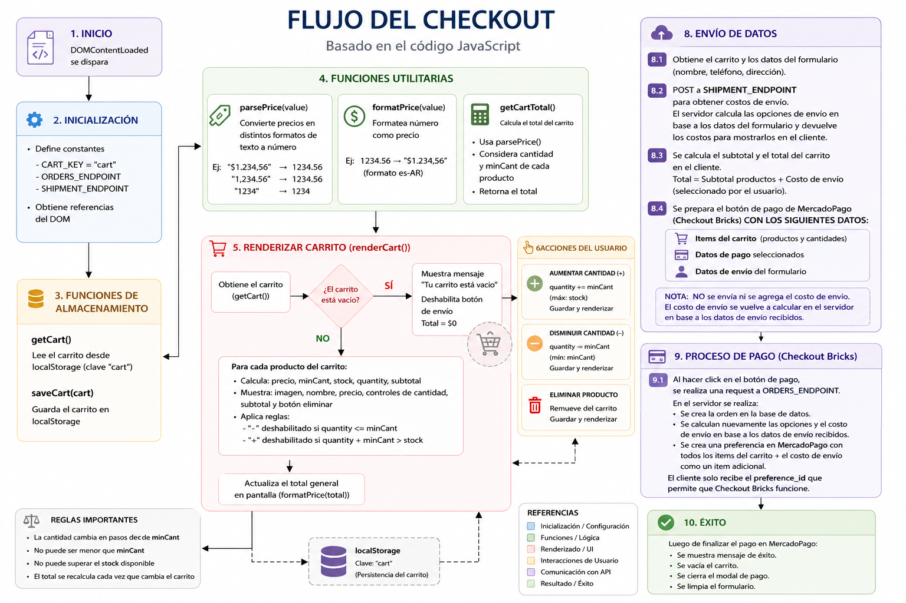

# 🛒 Familia Zaragoza Yerba Mate Website

A modern e-tienda whith checkout built with **HTML, CSS and Vanilla JavaScript**, featuring a persistent shopping cart, real-time shipping quotes, and **Mercado Pago Checkout Bricks** integration.

The application calculates shipping costs dynamically, creates secure orders on the server, and keeps all payment-sensitive logic in the backend.

## ✨ Features

- Responsive checkout built with HTML, CSS & JavaScript
- Mobile First design
- Shopping cart with LocalStorage persistence
- Dynamic product catalog loaded from REST API
- Quantity controls with stock validation
- Real-time shipping cost calculation
- Automatic subtotal, shipping and total calculation
- Mercado Pago Checkout Bricks integration
- Secure order creation on the backend
- Shipping recalculated server-side before payment
- WhatsApp integration with cart summary
- SwiperJS product carousel
- ScrollReveal animations
- Optimized for desktop, tablet and mobile devices

## 🚀 Checkout Flow

1. Products are loaded from the REST API.
2. The customer selects products.
3. The shopping cart is stored in LocalStorage.
4. Customer completes the checkout form.
5. Shipping methods and costs are requested from the backend.
6. The frontend updates:
   - Shipping options
   - Cart subtotal
   - Shipping cost
   - Final total
7. The Mercado Pago Checkout Brick is initialized using:
   - Cart items
   - Customer information
   - Shipping address
   - Selected payment method

> **Important:** At this stage the shipping cost is **not** sent to the server. Only the cart items and customer/shipping information are sent.

8. When the customer clicks **Pay**:
   - A request is sent to the **Orders API**.
   - The backend creates the order.
   - Shipping is calculated again on the server using the submitted address.
   - The shipping cost is added as a separate item to the Mercado Pago preference.
   - The Mercado Pago Preference is created.
   - Only the generated `preference_id` is returned to the frontend.

9. Checkout Bricks uses the received `preference_id` to complete the payment securely.

## 🔒 Security

All sensitive business logic is executed on the backend:

- Shipping calculation
- Order creation
- Mercado Pago Preference creation
- Final payment amount calculation

The frontend never sends or manipulates the final shipping amount, preventing price tampering.

## 🛠️ Technologies

- HTML5
- CSS3
- Vanilla JavaScript (ES6+)
- LocalStorage
- SwiperJS
- ScrollReveal
- REST API
- Mercado Pago Checkout Bricks

## 📦 Backend Responsibilities

- Product API
- Shipping quotation endpoint
- Order creation endpoint
- Mercado Pago Preference generation
- Shipping recalculation
- Order validation

💙 Visit my portfolio to see more projects like this: **https://jhonysouza100.site** 💙



## 📦 Vanilla HTML Deployment with Docker & Nginx
Este repositorio contiene un ejemplo simple de cómo desplegar un sitio web estático construido con HTML puro (vanilla HTML) utilizando Docker y Nginx como servidor web.

### 🚀 Características:

- Sitio web estático con HTML puro

- Configuración ligera y lista para producción

- Dockerfile para contenerizar la aplicación

- Configuración personalizada de Nginx

- Instrucciones para levantar el contenedor

### 🛠️ Tecnologías utilizadas:

- HTML5

- Docker

- Nginx

### Comandos

#### Construir una imagen
```cmd
docker build . -t [a-image-name]:[a-image-version]
```

#### Levantar un contenedor desde la imagen

```cmd
docker run -p [a-port]:80 [image-name]:[image-version]
```

---

> Nota: El puerto por defecto de Nginx es el puerto: 80